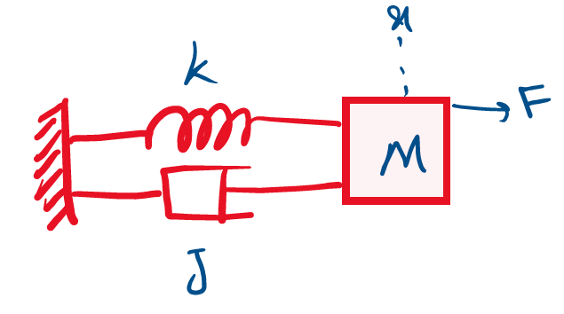

# Project:

## System Identification and Intelligent Controller Design on a Mass Spring Damper System

The goal of this project is to do a simple and secure system identification process on a Mass-Spring-Damper System using a Minimum Variance Unbiased Estimator Linear Model. Then 3 ways of designing a digital PID controller are implemented for the plant:
1. Using MATLAB’s PID tuner
2. Manual Tuning
3. Intelligent Methods.

Although the reasonably better way of tuning a PID controller will be to make some assumptions on the controller gains based on the simulation results using a trial and error procedure and using them as initial conditions for an Intelligent method, therefore fine-tuning the gains in the real process of the plant.

> **Note:** A complete guide for running the code is available in the README.txt. Plus, the whole analysis of the procedure is available in the **Reports** folder.